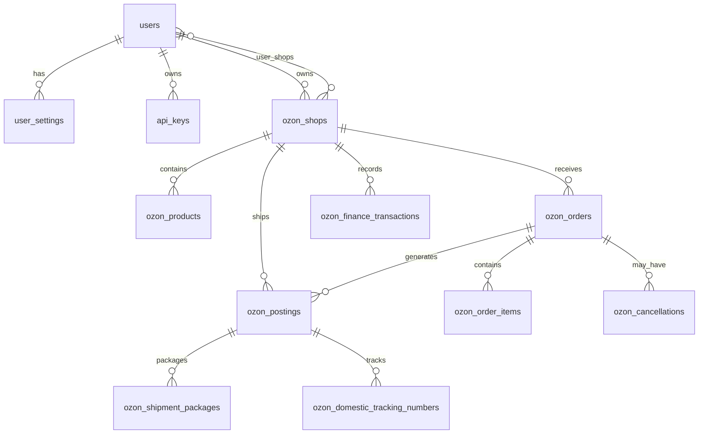

# EuraFlow 数据库结构

> 自动生成，请勿手动编辑。运行 `python scripts/generate_db_docs.py` 更新。

## 快速索引

共 **66** 张表，分为以下类别：

- [核心表](#core) (17 张)
- [OZON 插件表](#ozon) (47 张)
- [系统插件表](#system) (2 张)

## 核心表 {core}

ef_core 基础数据模型

| 表名 | 说明 | 文档 |
|------|------|------|
| api_keys | API密钥模型 | [查看](./core/api_keys.md) |
| audit_logs | 全局审计日志表

用于记录用户的数据修改操作，包括：
- 打印标签
- 价格修改
- 订单操作... | [查看](./core/audit_logs.md) |
| audit_logs_archive | 审计日志归档表

用于存储超过6个月的历史日志
结构与 audit_logs 完全相同 | [查看](./core/audit_logs_archive.md) |
| exchange_rate_config | 汇率配置表 - 存储API密钥和配置 | [查看](./core/exchange_rate_config.md) |
| exchange_rates | 汇率缓存表 - 存储历史汇率数据 | [查看](./core/exchange_rates.md) |
| inventories | 库存表 | [查看](./core/inventories.md) |
| listings | 商品价格表 | [查看](./core/listings.md) |
| account_levels | 主账号级别模型

用于定义不同级别的主账号配额限制，包括：
- 子账号数量限额
- 店铺数量限... | [查看](./core/account_levels.md) |
| order_items | 订单行项目表 - 按照 PRD § 3.2 | [查看](./core/order_items.md) |
| orders | 订单表 - 严格按照 PRD 定义 | [查看](./core/orders.md) |
| packages | 包裹信息表 | [查看](./core/packages.md) |
| refunds | 退款表（只读） | [查看](./core/refunds.md) |
| returns | 退货表（只读） | [查看](./core/returns.md) |
| shipments | 发运表 | [查看](./core/shipments.md) |
| user_login_sessions | 用户登录会话模型

用于实现单设备登录限制：
- 每次登录生成唯一会话令牌
- 新设备登录时使... | [查看](./core/user_login_sessions.md) |
| user_settings | 用户设置模型 | [查看](./core/user_settings.md) |
| users | 用户模型 | [查看](./core/users.md) |

## OZON 插件表 {ozon}

OZON 渠道插件数据模型

| 表名 | 说明 | 文档 |
|------|------|------|
| aliyun_oss_configs | 阿里云OSS配置模型（加密存储凭证） | [查看](./ozon/aliyun_oss_configs.md) |
| aliyun_translation_configs | 阿里云翻译配置表（单例模式，只有一条记录） | [查看](./ozon/aliyun_translation_configs.md) |
| chatgpt_translation_configs | ChatGPT翻译配置表（单例模式，只有一条记录） | [查看](./ozon/chatgpt_translation_configs.md) |
| cloudinary_configs | Cloudinary配置模型（加密存储凭证） | [查看](./ozon/cloudinary_configs.md) |
| ozon_api_metrics | API 调用指标 | [查看](./ozon/ozon_api_metrics.md) |
| ozon_attribute_dictionary_values | OZON属性字典值缓存表 | [查看](./ozon/ozon_attribute_dictionary_values.md) |
| ozon_cancellations | OZON 取消申请表 | [查看](./ozon/ozon_cancellations.md) |
| ozon_categories | OZON类目缓存表

注意：OZON的类目树设计允许同一个子类目（type_id）出现在多个父... | [查看](./ozon/ozon_categories.md) |
| ozon_category_attributes | OZON类目属性缓存表 | [查看](./ozon/ozon_category_attributes.md) |
| ozon_category_commissions | Ozon类目佣金模型 | [查看](./ozon/ozon_category_commissions.md) |
| ozon_chat_messages | OZON聊天消息 | [查看](./ozon/ozon_chat_messages.md) |
| ozon_chats | OZON聊天会话 | [查看](./ozon/ozon_chats.md) |
| ozon_collection_sources | OZON 自动采集地址表 | [查看](./ozon/ozon_collection_sources.md) |
| ozon_daily_stats | 每日统计汇总表

用于报表预聚合，每天凌晨由定时任务计算过去30天的数据。
订单生命周期长（发... | [查看](./ozon/ozon_daily_stats.md) |
| ozon_domestic_tracking_numbers | 国内物流单号表（一对多关系） | [查看](./ozon/ozon_domestic_tracking_numbers.md) |
| ozon_finance_sync_watermarks | 财务数据同步水位线（记录同步进度） | [查看](./ozon/ozon_finance_sync_watermarks.md) |
| ozon_finance_transactions | OZON 财务交易记录表（扁平化存储） | [查看](./ozon/ozon_finance_transactions.md) |
| ozon_global_settings | Ozon全局设置模型 | [查看](./ozon/ozon_global_settings.md) |
| ozon_inventory_snapshots | 库存快照（用于对账） | [查看](./ozon/ozon_inventory_snapshots.md) |
| ozon_invoice_payments | OZON 账单付款记录 | [查看](./ozon/ozon_invoice_payments.md) |
| ozon_media_import_logs | OZON媒体导入日志表 | [查看](./ozon/ozon_media_import_logs.md) |
| ozon_outbox_events | Outbox 模式事件表（保证分布式事务） | [查看](./ozon/ozon_outbox_events.md) |
| ozon_postings | Ozon 发货单（Posting维度） | [查看](./ozon/ozon_postings.md) |
| ozon_price_update_logs | OZON价格更新日志表 | [查看](./ozon/ozon_price_update_logs.md) |
| ozon_product_collection_records | OZON 商品采集记录表 | [查看](./ozon/ozon_product_collection_records.md) |
| ozon_product_import_logs | OZON商品导入日志表 | [查看](./ozon/ozon_product_import_logs.md) |
| ozon_product_selection_import_history | 导入历史记录 | [查看](./ozon/ozon_product_selection_import_history.md) |
| ozon_product_selection_items | 选品商品数据模型 | [查看](./ozon/ozon_product_selection_items.md) |
| ozon_product_sync_errors | Ozon 商品错误记录（OZON平台返回的商品错误信息） | [查看](./ozon/ozon_product_sync_errors.md) |
| ozon_product_templates | OZON 商品草稿与模板表 | [查看](./ozon/ozon_product_templates.md) |
| ozon_products | Ozon 商品映射表 | [查看](./ozon/ozon_products.md) |
| ozon_promotion_actions | Ozon 促销活动表 | [查看](./ozon/ozon_promotion_actions.md) |
| ozon_promotion_products | 商品活动关联表 | [查看](./ozon/ozon_promotion_products.md) |
| ozon_refunds | 退款/退货记录 | [查看](./ozon/ozon_refunds.md) |
| ozon_returns | OZON 退货申请表 | [查看](./ozon/ozon_returns.md) |
| ozon_shipment_packages | 发货包裹信息 | [查看](./ozon/ozon_shipment_packages.md) |
| ozon_shops | Ozon店铺模型 | [查看](./ozon/ozon_shops.md) |
| ozon_stock_update_logs | OZON库存更新日志表 | [查看](./ozon/ozon_stock_update_logs.md) |
| ozon_sync_checkpoints | 同步检查点（断点续传） | [查看](./ozon/ozon_sync_checkpoints.md) |
| ozon_sync_logs | 同步日志 | [查看](./ozon/ozon_sync_logs.md) |
| ozon_warehouses | OZON 仓库模型 | [查看](./ozon/ozon_warehouses.md) |
| ozon_webhook_events | Webhook 事件记录 | [查看](./ozon/ozon_webhook_events.md) |
| sync_service_logs | 同步服务执行日志表 | [查看](./ozon/sync_service_logs.md) |
| sync_services | 同步服务配置表 | [查看](./ozon/sync_services.md) |
| watermark_configs | 水印配置模型 | [查看](./ozon/watermark_configs.md) |
| watermark_tasks | 水印任务模型 | [查看](./ozon/watermark_tasks.md) |
| xiangjifanyi_configs | 象寄图片翻译配置表（单例模式，只有一条记录） | [查看](./ozon/xiangjifanyi_configs.md) |

## 系统插件表 {system}

系统级插件数据模型

| 表名 | 说明 | 文档 |
|------|------|------|
| sync_service_logs | 同步服务执行日志表 | [查看](./system/sync_service_logs.md) |
| sync_services | 同步服务配置表 | [查看](./system/sync_services.md) |

## 核心表关系图

